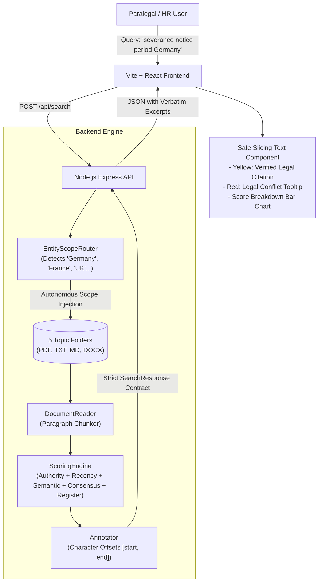

# Digital Personal HR Paralegal — Semantic Search Engine MVP

A full-stack TypeScript & Node.js boilerplate and core logic implementation for an enterprise **HR / Legal Paralegal Search & Verification Engine**. 

Designed strictly with an **interface-driven, non-conversational API contract**: it never generates hallucinated LLM prose; it extracts verbatim paragraph excerpts from governing legal sources, computing character-offset inline highlights (**Yellow** for verified clauses, **Red** for legal conflicts) with multi-criteria statutory ranking.

---

## 🏗️ Architecture & Component Flow



---

## 📂 Project Structure

```
.
├── shared/
│   └── types.ts                    # Crucial Shared API Contract (Query, Response, Paragraph, Highlights, Metrics)
├── server/
│   ├── src/
│   │   ├── index.ts                # Express server (/api/search, /api/documents/:id)
│   │   ├── corpus/                 # 5 Local Topic Folders (17 dummy legal files)
│   │   │   ├── 01-parental-leave/
│   │   │   ├── 02-severance-termination/
│   │   │   ├── 03-remote-work-relocation/
│   │   │   ├── 04-employee-inventions-ip/
│   │   │   └── 05-statutory-compliance-eu-uk/
│   │   └── services/
│   │       ├── documentReader.ts   # Ingress parser for PDF, TXT, MD, DOCX
│   │       ├── entityScopeRouter.ts# Entity/Jurisdiction scope injection
│   │       ├── scoringEngine.ts    # 5-factor scoring & ranking algorithm
│   │       ├── annotator.ts        # Exact [startIndex, endIndex] legal highlighter
│   │       └── mockSemanticSearch.ts # Engine orchestrator + Vector DB hooks
├── client/
│   ├── src/
│   │   ├── components/
│   │   │   ├── SearchBar.tsx       # Minimalist Google-style search bar + suggestions
│   │   │   ├── ParagraphCard.tsx   # Excerpt card with score pill & source badges
│   │   │   ├── HighlightedText.tsx # Collision-free text slicing algorithm
│   │   │   ├── ConflictTooltip.tsx # Red highlight hazard explanation popover
│   │   │   ├── ScoreBreakdownTooltip.tsx # Score weighting breakdown bar chart
│   │   │   ├── EntityRoutingBanner.tsx # Entity scope notification
│   │   │   └── DocumentViewerModal.tsx # Full source document context inspection
│   │   ├── App.tsx                 # Main paralegal workspace UI
│   │   └── main.tsx
└── package.json
```

---

## ⚡ Quick Start

### 1. Install Dependencies
```bash
# Install server dependencies
cd server && npm install

# Install client dependencies
cd ../client && npm install
```

### 2. Run the Application
In two separate terminals:

```bash
# Terminal 1: Start Backend (Port 3001)
cd server
npm run dev

# Terminal 2: Start Frontend (Port 3000)
cd client
npm run dev
```

Open your browser at **`http://localhost:3000`**.

---

## 🧪 Sample Search Queries to Test

1. **`Parental leave notice period Germany`**
   - *Autonomous Routing:* Detects country `Germany` → Injects German BEEG §16 and BGB into search scope.
   - *Yellow Highlight:* Verifies statutory 7-week notice benchmark under BEEG §16(1).
   - *Red Highlight:* Flags internal HR handbook clause demanding 12 weeks notice as unenforceable overreach.

2. **`Terminate senior engineers with 2 weeks notice`**
   - *Red Highlight:* Flags internal email claiming senior engineers in Berlin can be dismissed with 2 weeks notice as a **critical statutory violation** under German Civil Code BGB §622(2).

3. **`Severance redundancy calculation France`**
   - *Yellow Highlight:* Cites French Code du Travail Art. R1234-2 (1/4 month's salary per year of service for first 10 years).

4. **`Weekend hackathon code ownership and side projects`**
   - *Red Highlight:* Detects overreaching internal IP memo claiming weekend open-source code belongs to the company without statutory remuneration under ArbEG §9.

---

## 🔌 Production "Second Brain" Vector DB Migration Guide

In [`server/src/services/mockSemanticSearch.ts`](file:///home/Basti/Documents/Tectonic-Elektrisch-Vuur/server/src/services/mockSemanticSearch.ts), the engine is architected to seamlessly swap the mock scoring with production vector databases (Pinecone, Qdrant, Weaviate, or pgvector):

```typescript
// 1. Production Dense Embedding Generation
const queryEmbedding = await openai.embeddings.create({
  model: 'text-embedding-3-large',
  input: query
});

// 2. Metadata-Filtered Hybrid Search
const searchResults = await pinecone.index('hr-legal-brain').query({
  vector: queryEmbedding.data[0].embedding,
  topK: 25,
  filter: routingInfo.injectedDocumentIds.length > 0 
    ? { id: { $in: routingInfo.injectedDocumentIds } } 
    : undefined,
  includeMetadata: true
});
```
